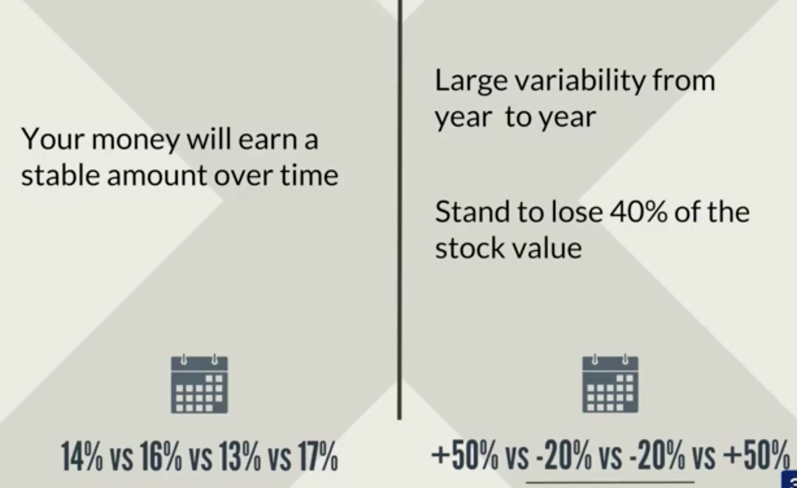
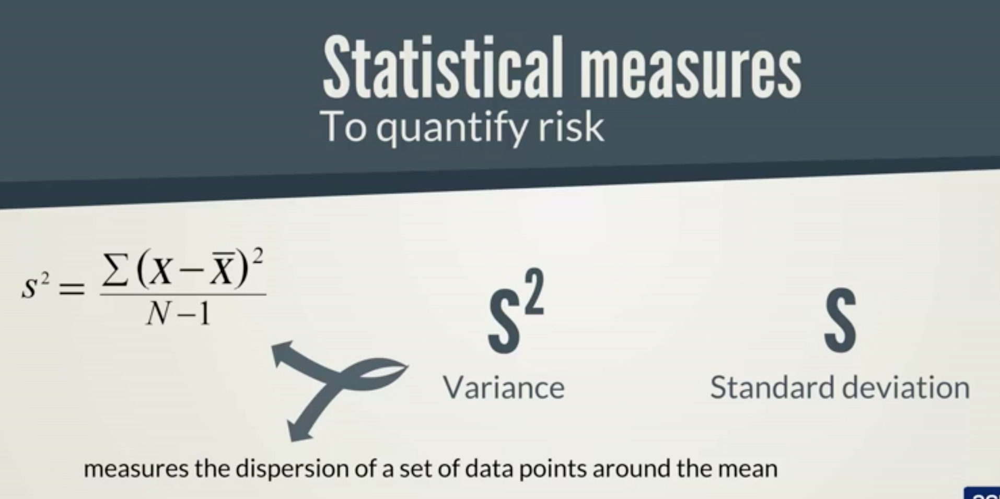
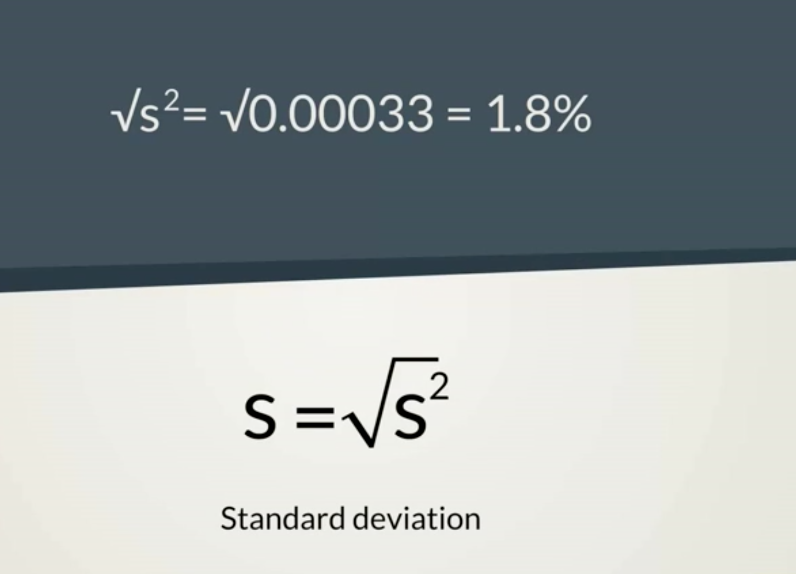
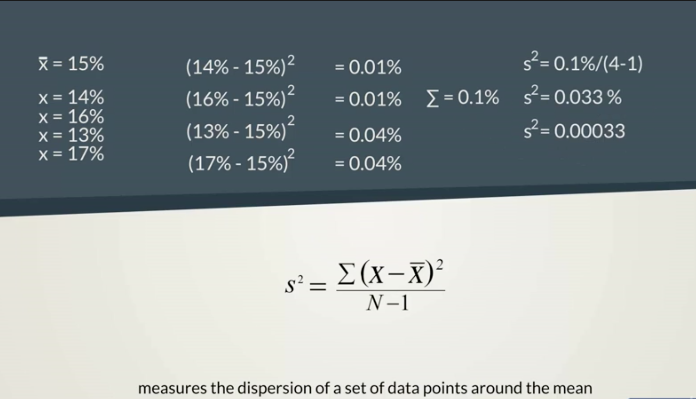
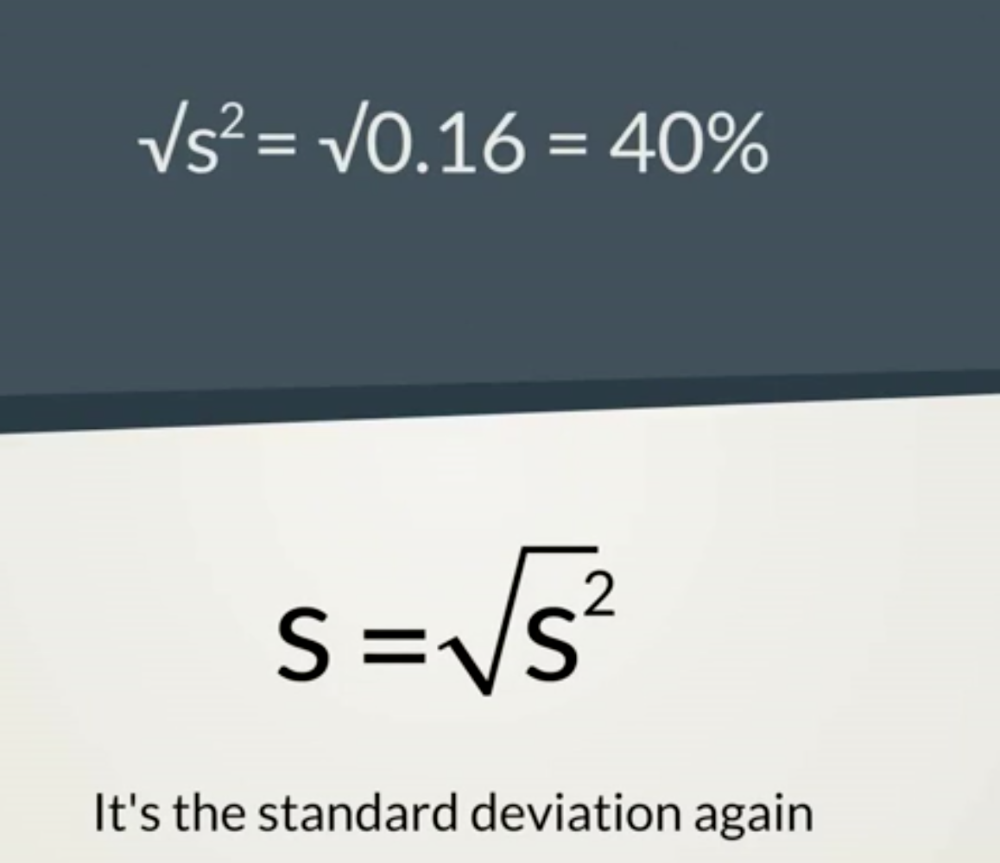
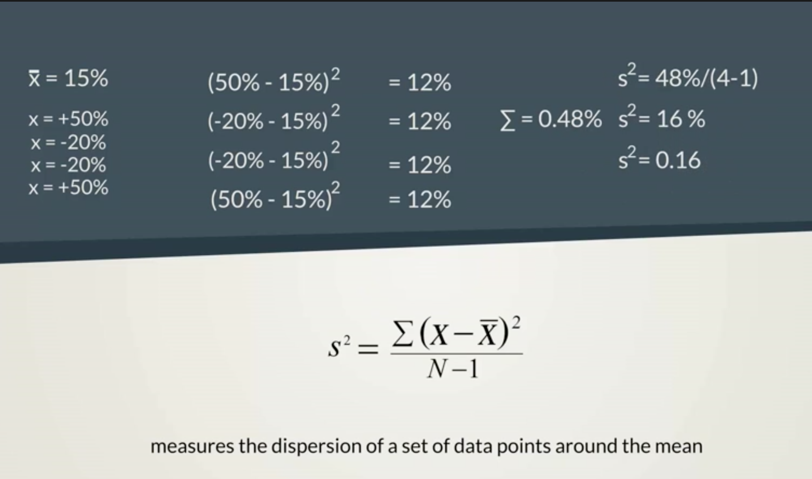

# Measure a Security's risk
## Stock Value over time

Variance measures the dispersion of a set of data points around the mean.

## Standard Variance - Example 1:
The mean = 15%

## Standard Deviation - Example 1:
Given the variance of 0.00033

## Standard Variance - Example 2:

## Standard Deviation - Example 2:
