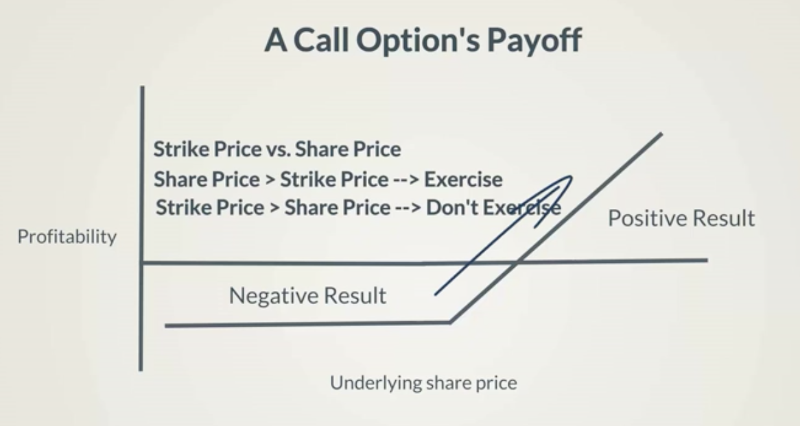
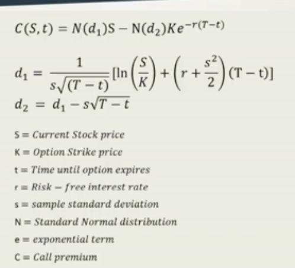

# Black Scholes Formula
An important tool for derivatives pricing. It was arrived at by Fischer Black, Byron Scholes and Robert Murton in 1973. It is the primary tool for derivatives pricing.

## The Black Scholes Framework

### What does the Black Scholes formula do?
#### It calculates the value of an option.
The holder of the option may decide he wants to buy the stock, but he may also decide he is better off without doing it. This freedom is valuable to every investor. Hence, it has a price.

## The formula

## In a nutshell
The Black Scholes formula calculates the value of a call by taking the difference between the amount you get if you exercise the option minus the amount you have to pay if you exercise the option.