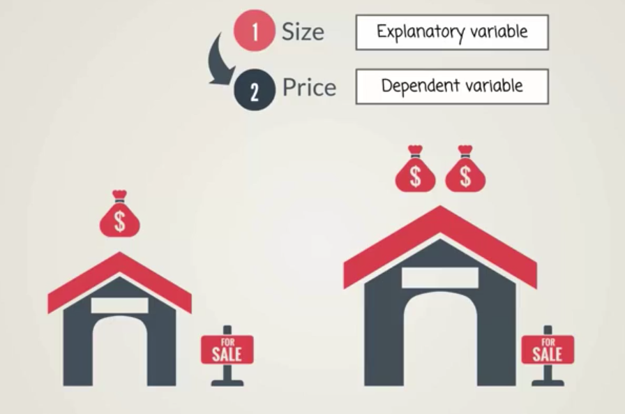
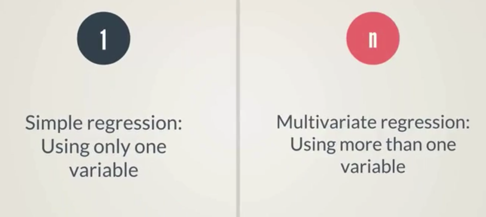
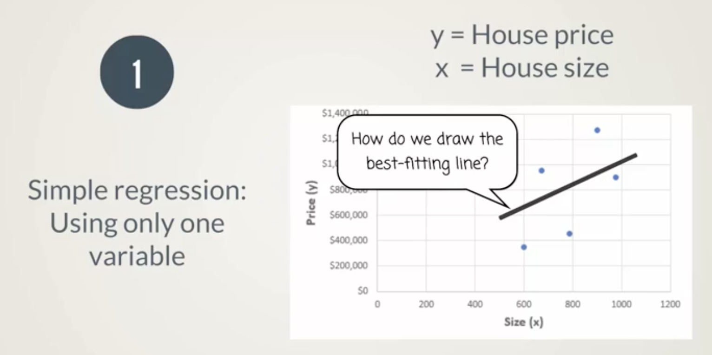
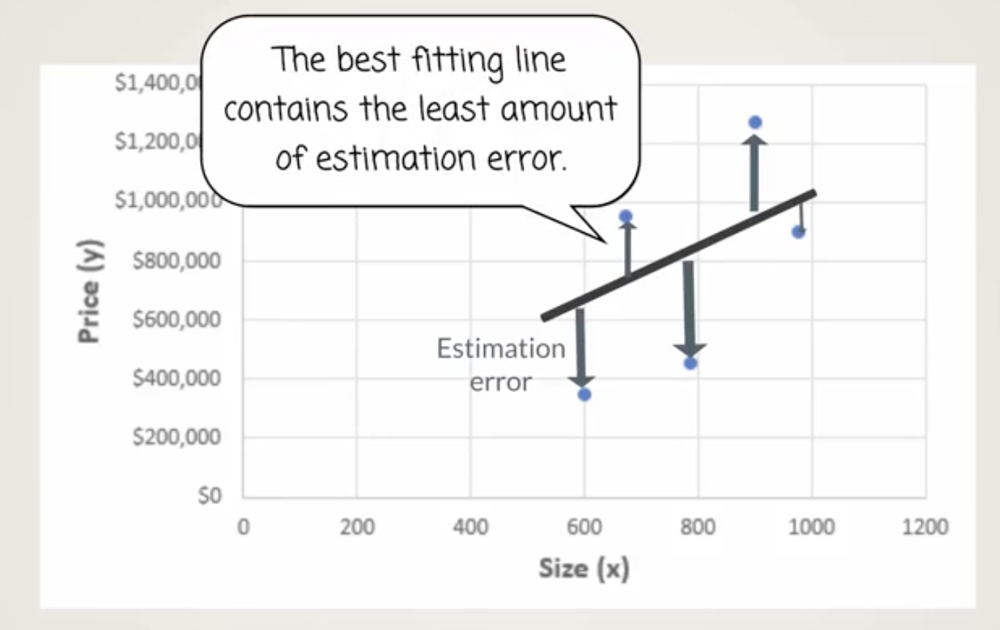
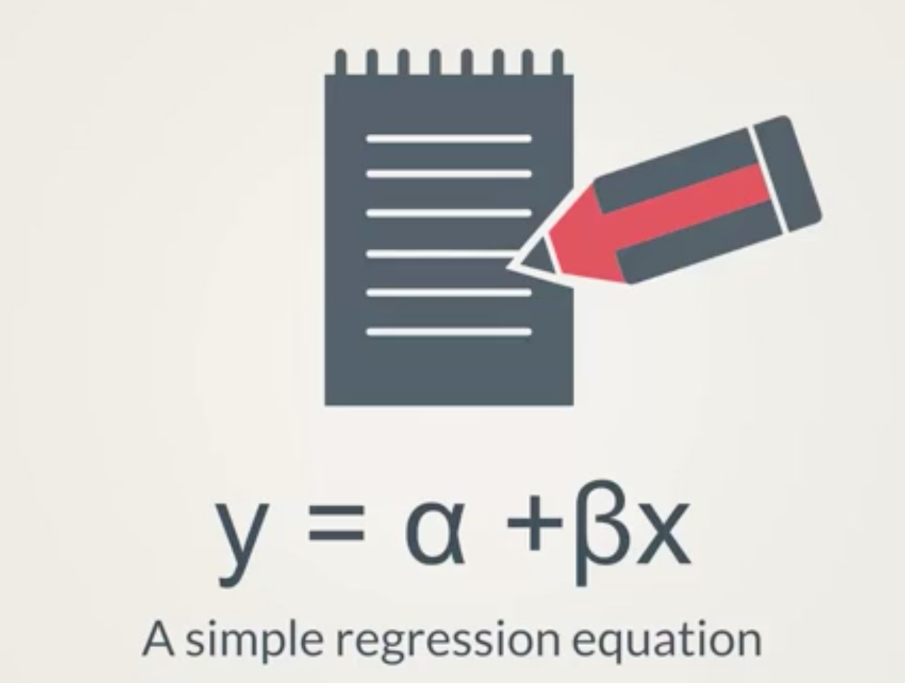
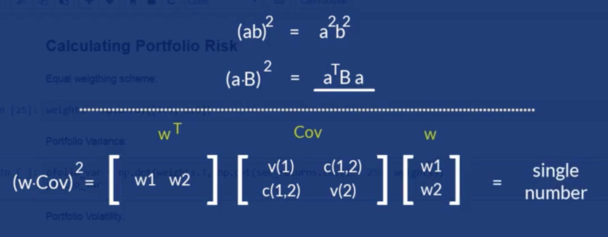
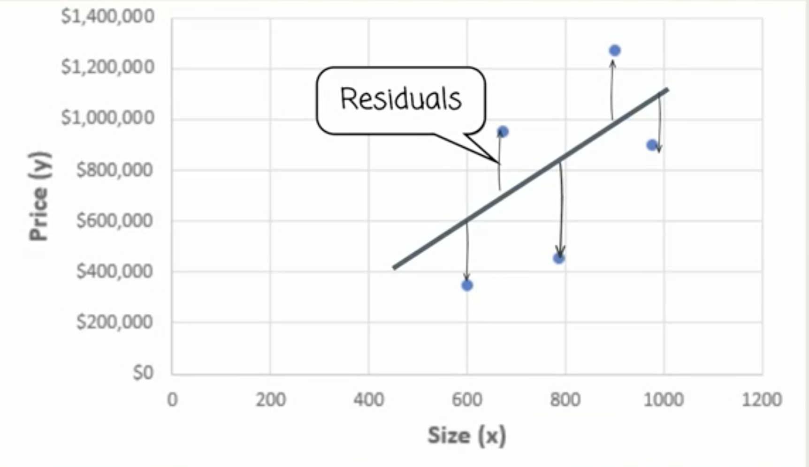
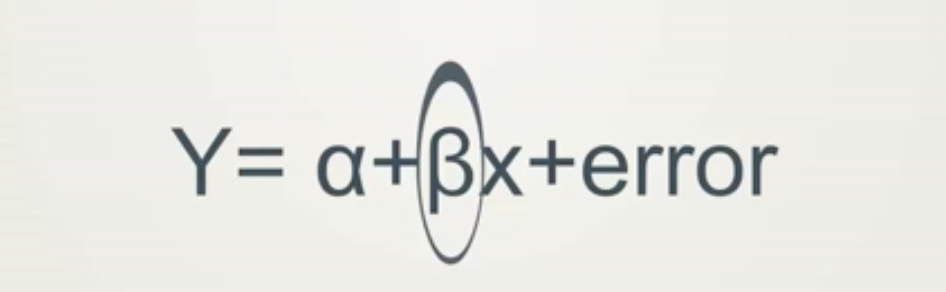
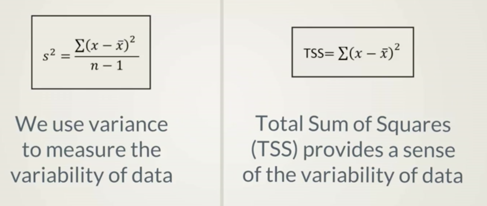
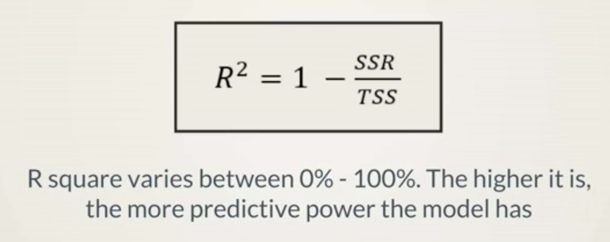

# Calculating Regression
Regression analysis is quantifying the relationship between 2 variables.

Regression has 2 types of variables:
* Explanatory variables
* Dependant variables

Lets take the price of a house. The price of a home has a direct relationship on the price of the house.



If we know the value of the explanatory variable, house size, we can determine the expected value of the dependant variable, house price.

## Types of Regression
* Using 1 variable in a regression, is called a Simple regression.
* Using multiple variables is called a multivariate regression.




## Simple regression
Using only 1 variable in a regression, it is called a Simple regression.



Q: How do we determine the best line to help us better understand the relationship between house prices and house size?
A: We have to find a line that minimizes the error observed between itself and actual observations.



Each deviation from the line is an error.

### Equation for a Simple regression



```
y = Alpha + Beta * x
```



# So which regressions are reliable?

## House Prices
More than one variable determines the value of house prices.

* Location
* Neighborhood
* Year of Construction

A simple regression will omit some import factors, which will result in an estimation error.

```
Y = Alpha + Beta * x + error
```

When we talk about sample observations the errors are called residuals.



The best fitting line minimizes the sum of the squared residuals.

The coefficients found with this technique are called OLS estimates.
(Ordinary least square estimates)



# All all regressions created equal?
Certain variables are better at predicting other variables.

House size is one of the best indicators of house prices.

Some regressions have a higher explanatory power than others.

# Good vs Bad Regressions
Using the R square





Typically an R2 with less than 10% has little predictive value.

One variable regressions with an R2 value of 30% or more are solid indicators of future performance.


