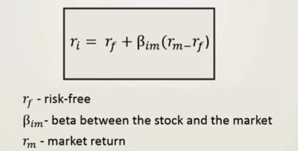
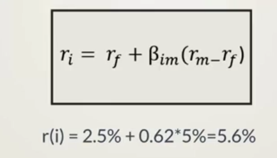

# Capital Asset Pricing Model




```
risk-free = risk-free + beta between the stock and the market(market return - risk-free)
```

***risk-free*** is the bare minimum risk an investor will accept.

## Applying the CAPM in practice

### Risk-free
Approximate with 10-year US government bond yield: 2.5%

### Beta
Approximate the market portfolio with the S&P500: 0.62

### Equity Risk Premium
Historically, it has been between 4.5% and 5.5%



r(i) = 2.5% + 0.62*5% = 5.6%


According to the CAPM, the variance of the stock is not relevant to the calculation of the expected return of a stock.