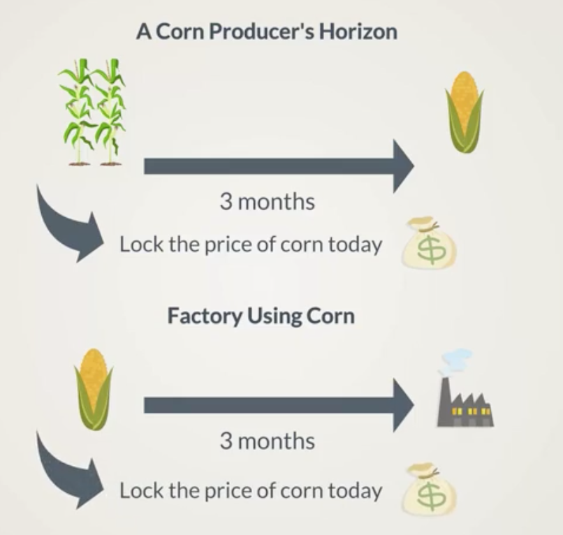
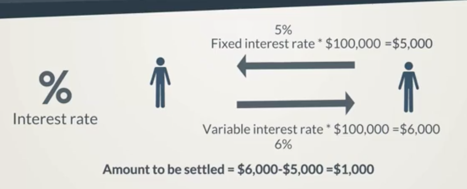

# Derivative Contracts
A derivative is a financial instrument, whose price is based on the development of one or more underlying assets.

* stocks
* bonds
* interest rates
* commodities
* exchange rates

A contract between at least two parties describing how they will exchange payments.

## Trading Derivatives

How they are traded:
* Regulated Markets - A uniform contractual structure
* Over the Counter Markets (not regulated)

Originally, derivatives served as a hedging instrument
Businesses would sell derivatives to clients based on incomes the company would see in 3 months therefore having access to the cash today.

With time financial institutions innovated significantly. Today there are many types of derivatives.

### Groups of people dealing with derivatives:

#### Hedging
People interested in hedging their investments.

#### Speculating
Speculators

#### Aribtrageurs
Traders interested in finding pricing discrepancies and profiting from them assuming no risk.

## Four Main types of Derivatives

### Forwards
Two parties agress that one party will sell to the other an underlying asset at a future point of time.

Example:
Lets say i'm a corn producer and 3 months from now i'll have a certain amount of corn that's produced and needs to be sold. I'd like to fix the price of the corn today and be certain of the revenue I can expect.

This is a classic example of hedging the contract is sold to reduce risk.

The party who agrees to buy the corn could be a corn factory that must lock the cost of its raw materials.

Both parties benefit from the contract.

### Futures
Highly standardized forward contracts typically stipulated in a market place.

The difference between Forwards and Futures is the level of standardization and the participation of a clearinghouse.

The transaction goes through the marketplace and the parties do not know each other.

### Swaps
Two parties agree to exchange cash flows based on an underlying asset at a future point of time.

Swap contracts can be based on plenty of underlying assets:
* Interest rate
* Stock Price
* Bond Price
* Commodity

The most widely used swap contract are interest rate swaps. One party agrees to receive cash flow based on a fixed interest rate while the other party agrees to receive cash flow based on a floating interest rate.

### Options

