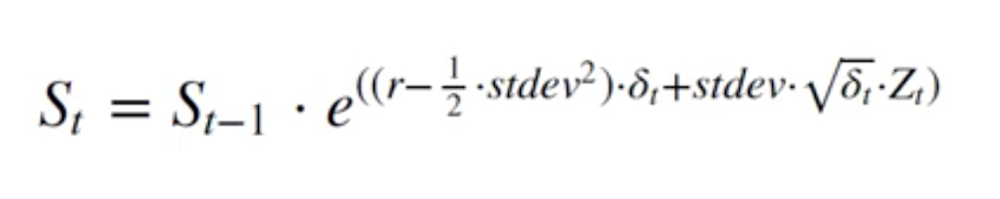

# Euler Discretization

* Monte Carlo simulations can provide us with thousands of possible call option prices
* We could average the payoff and discount it back to today

## Euler Discretization Formula:



Stock Price at day t = stock price at day t - 1 * e ** ((risk-free rate - 1/2 * stdev**2) * fixed time interval (delta t) + stdev * sqrt(delta t * random component Z)

```python
object.values
transfers the object into a numpy array
```
