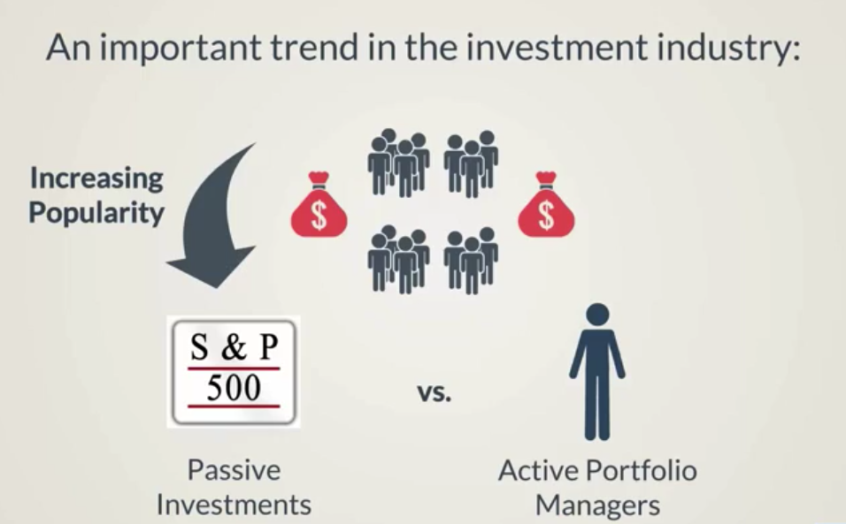

# Interpreting Alpha
Alpha shows us how much return we get without bearing extra risk.

A measure of how good or bad an investment manager is doing.

The standard CAPM setting assumes an alpha equal to 0.

A good portfolio manager outperforms the market and earns a positive alpha.

A poor portfolio manager underperforms the market and earns a negative or zero alpha.

### How does an investment manager try to outperform the market?

#### Passive Trading
Investing in a market index (S&P500) and waiting patiently

#### Active Trading
Adjusting investment portfolios on a frequent basis

## Comparing Investments
We can only compare the alpha of investments with a similar risk profile.

## Trends
Most investors know that well diversified and passive index tracking funds, charging low fees, are very efficient.

