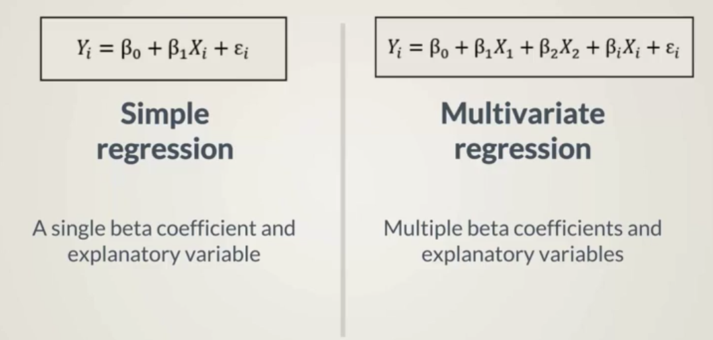
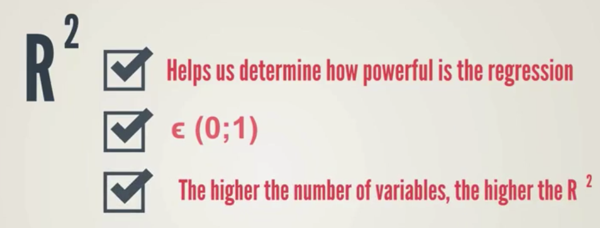
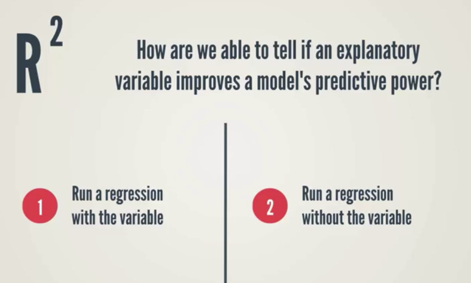

# Multivariate Regressions
A regression considering multiple variables should provide a prediction that is closer to true results.

## Formula

Calculating a best fitting line across multiple dimensions

## How are we able to tell if an explanatory variable improves predictive power?

Observe how R squared changes.

If it is higher the first time, then this independent variable has good explanatory power and its value contributes to the explanation of value of the independent variable.

### Alternatively, we can compare the p-values of beta coefficients (the probability that the beta coefficients should have been different)

* Low p-value: There is a low chance that the beta coefficients are different than estimated
* A p-value that is lower than 5% allows us to state: "We can be 95% confident that the beta coefficient we've estimated is different than 0."

Beta coefficients estimated in a multivariant regression can be interpreted as the marginal impact of the explanatory variable.

