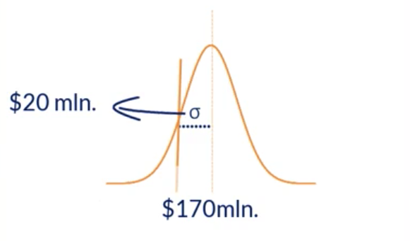
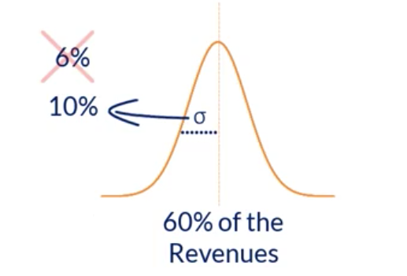

# Predict the firm's future gross profit

## Requirements
* Expected Revenue
* Expected COGS (Cost of Goods Sold)

We will start by performing 1,000 simulations of the company's expected revenues.

Expected Revenue for this year is $170 million

Standard deviation is 20 million

COGS amount to 60% of revenues

See gross_profit.py for this simulation

