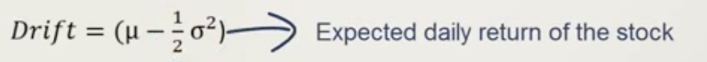

# Predicting Stock Prices

We can predict stock price using the following formula:

```
Price Today = Price Yesterday * e ** r
```

r: log return of share price between yesterday and today

or

```
ln(price today / price yesterday)
```

So the actual formula is:

```
Price Today = Price Yesterday * e ** ln(price today / price yesterday)
```

## We can use Brownian motion in order to model r:


### Drift
The direction rates of return have been headed in the past.

Calculate average, standard deviation and variance of daily returns in the historical period




### Volatility