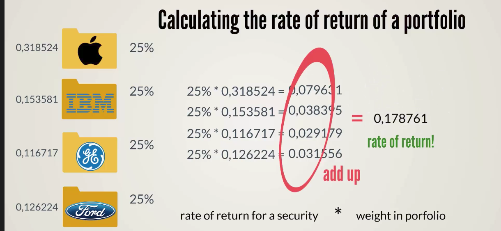
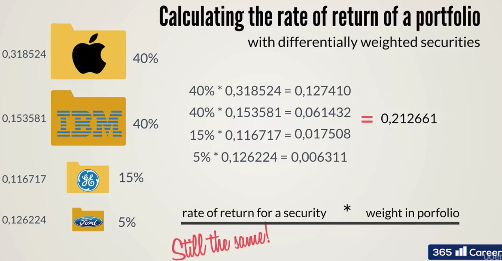

# Calculating the rate of return of a portfolio
To calculate the rate of return of a portfolio you need to know the weight of each stock in the portfolio.

## All stocks equal weight

## Varying weights of stocks

numpy.dot() - calculates the vector or matrix products
