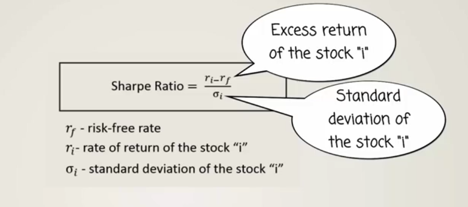
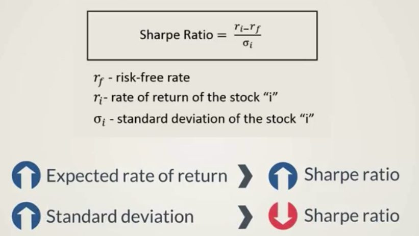

# Sharpe Ratio
Rational investors want to be able to compare stocks in terms of risk-return performance.

William Sharpe came up with the sharpe ratio.

### The Sharpe ratio allows us to compare:
* Stock A vs. Stock B
* Investment Portfolio A vs. Investment Portfolio B

The variance of the market is irrelevant to the calculation of the Sharpe ratio.