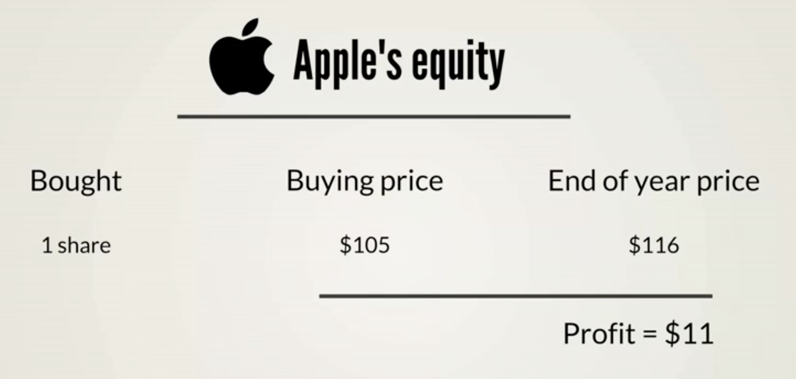
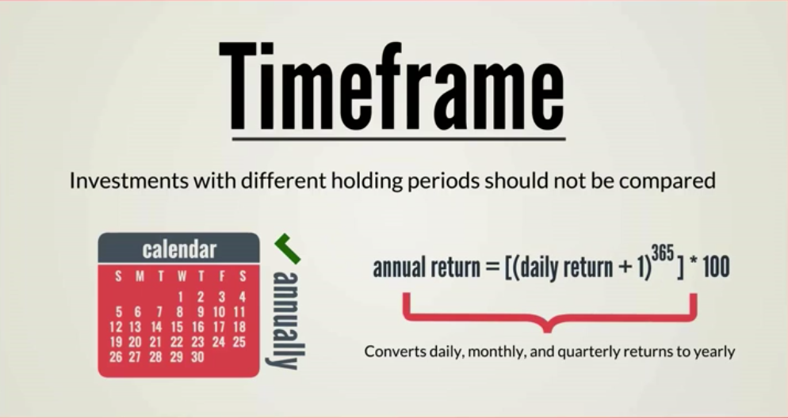

# Simple Rates of Return

## Calculating the return on a single investment
Lets say you purchase 1 share of Apple stock at the beginning of the year for $105.
You sell the stock at the end of the year for $116. Not factoring in the costs of the transactions, you have made a profit of $11.



## Calculate Simple Rate of Return
For the Apple trade above calculate the simple rate of return.

### Formula for Simple Return:
rate of return = (ending price - beginning price) / beginning price

```
10.5% = ($116 - $105) / $105
```

Now let' say Apple paid you $2 dividend on that same stock.

```
12.4% = (($116 + $2) - $105) / $105
```

### Formula for Logarithmic rate of return:

```
10.0% = log($116) / log($105) = log($116 - $105)
```

### When to use Simple vs Log formula?
#### Simple Returns
When dealing with multiple assets over the same timeframe
#### Logarithmic Rate of Return
When you make calculation about a single asset over time

Investors typically calculate daily, monthly, quarterly, or annual returns.


